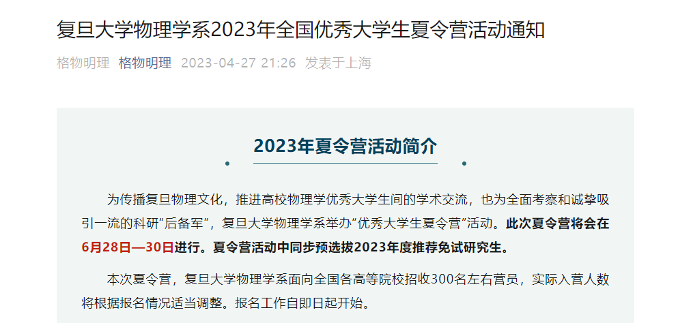
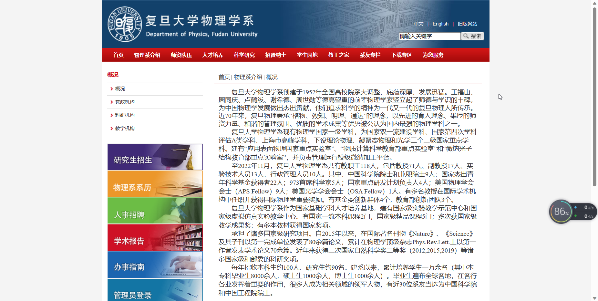
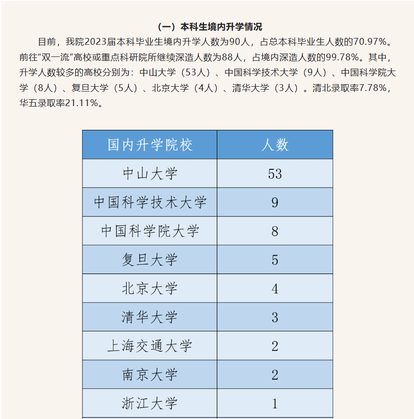
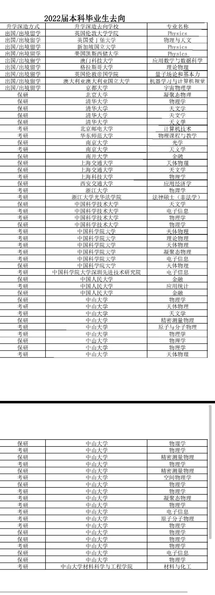
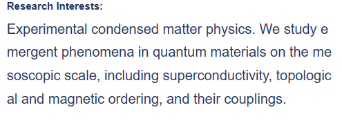
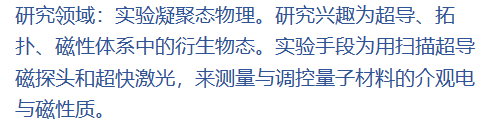
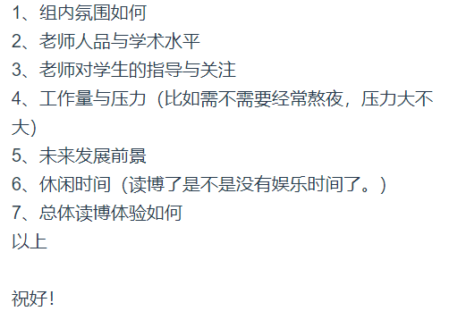
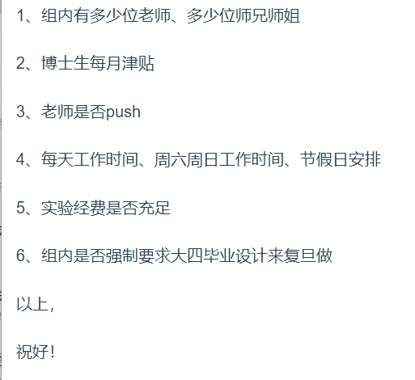

# 如何搜集保研信息

保研要搜集哪些信息，如何搜集这些信息？

重要的保研信息：**各个学校的招生信息**、本院往届学生保研情况、**各个学校夏令营考核方式**、各个学校导师的研究方向、**意向导师的人品与组内情况**

一、学校的招生信息：

各个学校的夏令营报名通知一般在大三下学期4-6月公布，夏令营活动开展时间“一般”在6-7月，但是有些学校或研究所的时间可能提前或延后。**关注对应学校的物理学院微信公众号一般可以看到最早的报名通知。** 下面以复旦大学物理学院2023年夏令营为例。

大三下，4月27日复旦大学物理系公众号“格物明理”发布夏令营通知（[复旦大学物理学系2023年全国优秀大学生夏令营活动通知 (qq.com)](https://mp.weixin.qq.com/s/Z4yMDFvQdlKDvK6f5QnbdA)）。了解到本次夏令营入营300人，为了解**优营率**，百度“复旦大学物理学院”，浏览相关信息。在“物理系介绍”一栏看到如下内容：

了解到该院每年招收研究生约90人，同时通过往届师兄师姐那里了解到每年夏令营优秀营员约100人，所以**复旦物院夏令营通过率约为1/3**.（实际通过率应该有一些差异，比如该院逐年扩招会使通过率上升）。

其余的招生信息例如报名时间、报名材料、是否报销路费也可以通过类似的方式了解到。在2023年夏令营活动中，有以下需要注意的信息，仅供参考，具体以最新通知为准：

1. 不同学校需要提交的材料复杂程度不同，有些需要个人陈述，有些需要2封推荐信
2. 已知中科院理论所和南京大学需要提前联系老师给**内部推荐**信，相当于是与老师的提前面试，并且有可能是拿了哪位老师的推荐信就在他那里读研。
3. 有些学校和研究所的夏令营活动会在我院期末考试前就开展，比如中科大合肥微尺度研究中心（这是一个很大的研究中心，量子技术、粒子物理都有涉及）就是如此，并且当天我院去参加面试的同学绝大部分都拿到了优营资格。
4. 所有的学校都要求拿到优营的同学自行联系意向导师，与导师双向确认，方可最终录取。不同学校优营率差异较大，比如南京大学要求提前拿到导师推荐的同学才能进入夏令营面试环节，而这些拿到导师推荐的同学基本都通过了。（南大每年收300人左右）
5. 报名夏令营前想清楚是直博还是硕士，有些学校硕士名额很少，可能报硕士连入营都入不了，比如上海交通大学。但是报直博也不是轻松的选择。需要慎重考虑。
6. 如果有课程期末考试与夏令营冲突，需要咨询教务处老师（本院目前是钟儒发老师），**缓考课程是否影响保研资格**。（2020级与前几级咨询的结果是不影响）
7. 本院往届学生保研情况

2019级（2023届毕业生）[物天招宣 | 再创佳绩！物理与天文学院2023届本科毕业生升学深造率出炉！ (qq.com)](https://mp.weixin.qq.com/s/mP273wsGO7qGgTNOsiY\_-Q)

124人

但需要注意的是，其中包含了考研学生。假设我院保研率26%，那么其中有32人是保研到了中大、华五、清北等学校。

2018级（2022届毕业生）

 

二、各个学校夏令营考核方式

一般夏令营考核内容为“英语 + 个人介绍 + 四大力学 + 报考二级专业对应内容 + 科研经历 + 思考性问题”。

有以下注意点

1. 英语可能与个人介绍同时考察，所以需要准备英文自我介绍
2. 个人介绍里可以与报考二级专业融合，介绍一下自己的看法，展示自己的兴趣
3. 四大力学问题的考察，是先抛出一个问题，再根据你的回答就这个问题中的一些细节越问越深入
4. 报考二级专业对应内容表面面试问题会有一定倾向，比如凝聚态物理对应固体物理，光电科学对应光学、电动力学
5. 科研经历没有就老实说没有，这个不是特别重要
6. 思考性问题不一定要答对，但需要展现你分析一个问题的过程
7. 各个学校导师的研究方向

详情见对应学院官网的教职工目录，老师的研究方向大多是可以归类的，有英文介绍的建议看一下英文介绍，看中文的研究方向介绍可能会觉得不知所云，甚至会被劝退。举个例子

 

三、意向导师的人品与组内情况

发邮件问意向导师的学生/直接问老师本人，不过要注意**问的问题要具体，不要太宽泛。**太宽泛只会得到毫无意义的正面评价。下面分别是错误示范和正确示范

 
